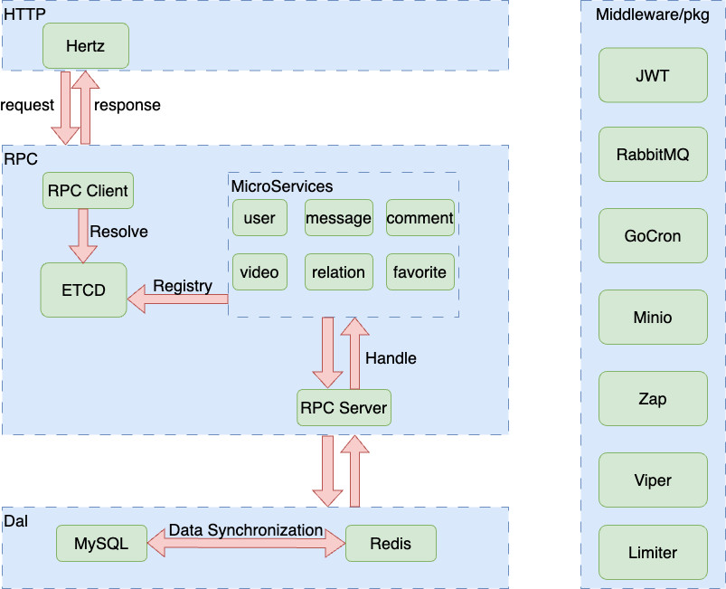
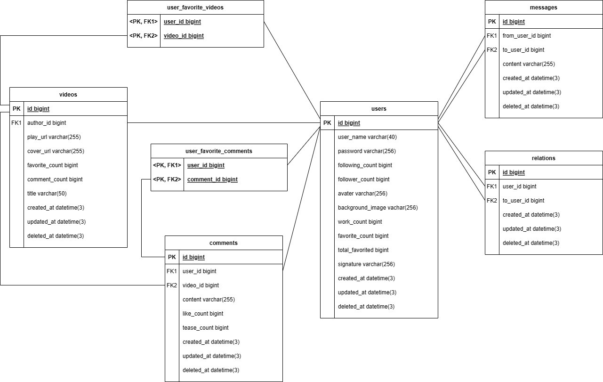
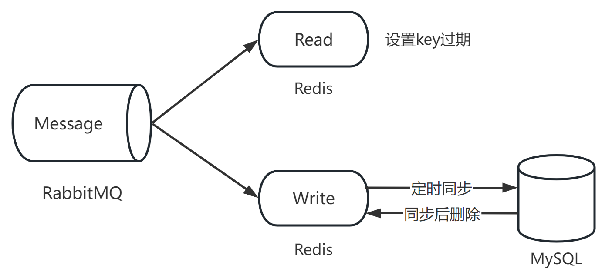
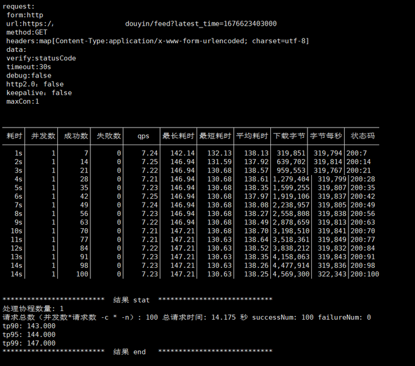
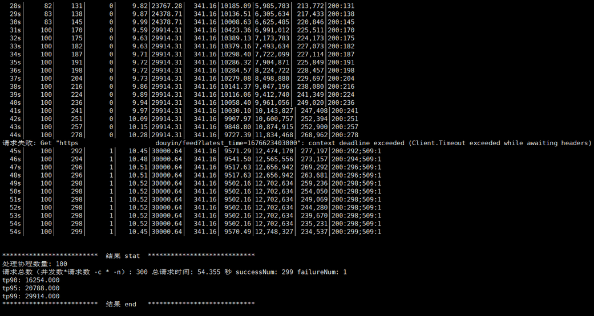
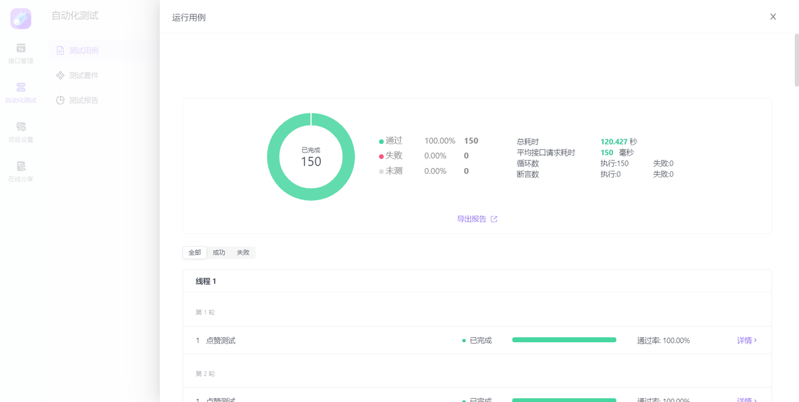
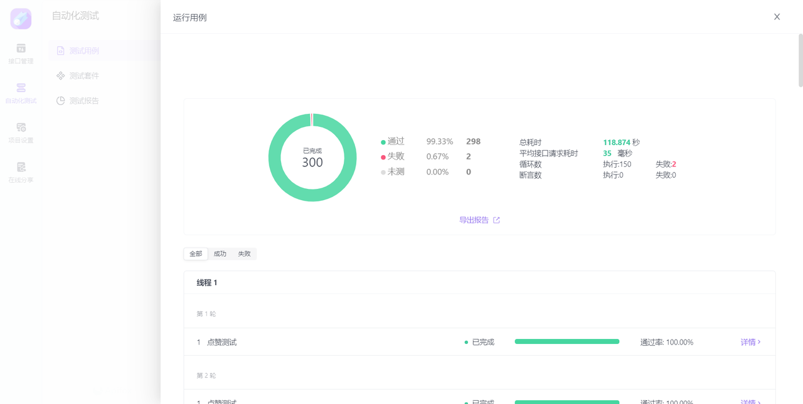
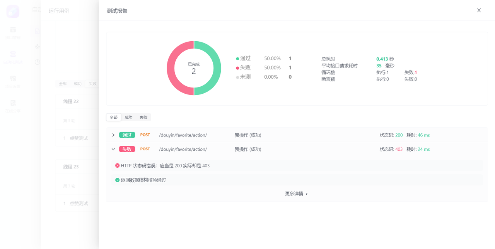
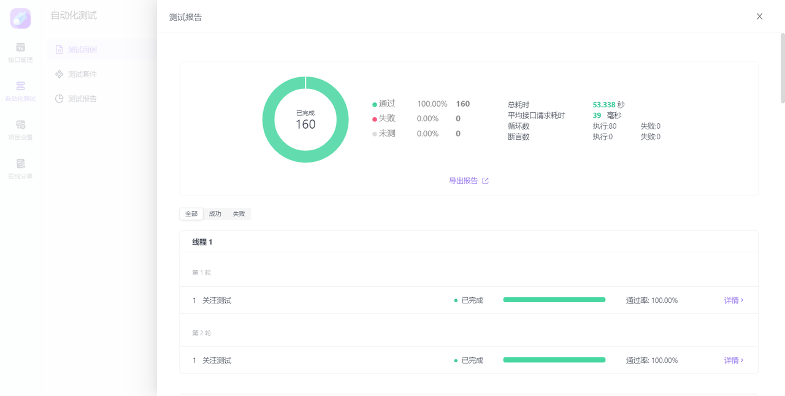

# 简易版抖音-dousheng

## 一、项目介绍

### 			    基于 “Hertz/Gin HTTP框架 + Kitex  RPC框架” 完成的第五届字节跳动青训营—极简版抖音项目，采用微服务的架构


## 二、项目设计

### 1、架构设计



### 2、技术栈

- ##### Hertz：提供 HTTP 服务

- ##### Kitex：提供 RPC 服务

- ##### ETCD：服务注册与发现

- ##### JWT：token 的生成与校验

- ##### Minio：图片和视频的对象存储

- ##### Gorm：对 MySQL 进行 ORM 操作，使用 Gorm 的 db-resolver 插件进行MySQL读写分离操作

- ##### Redis：对点赞/取消赞和关注/取关操作进行缓存，按照一定策略使键过期，并定时同步数据到数据库

- ##### RabbitMQ：异步任务队列、流量削峰

- ##### Gocron：定时任务，同步 Redis 与 MySQL 之间的数据

- ##### Viper：读取配置文件；

- ##### Zap：日志打印

- ##### Nginx：反向代理与负载均衡。


### 3、模块介绍

|   功能项   | 功能需求     | 测试点                                                       |               模块               |
| :--------: | ------------ | ------------------------------------------------------------ | :------------------------------: |
| 基础功能项 | 视频 Feed 流 | 支持所有用户刷抖音，视频按投稿时间倒序推出                   |           获取视频列表           |
|            | 视频投稿     | 支持登录用户自己拍视频投稿                                   |             发布视频             |
|            | 个人主页     | 支持查看用户基本信息和投稿列表，注册用户流程简化             |               注册               |
|            |              |                                                              |               登录               |
|            |              |                                                              |             个人信息             |
| 方向功能项 | 喜欢列表     | 登录用户可以对视频点赞，在个人主页喜欢Tab 下能够查看点赞视频列表 |           获取喜欢列表           |
|            |              |                                                              |               点赞               |
|            |              |                                                              |              取消赞              |
|            | 用户评论     | 支持未登录用户查看视频下的评论列表，登录用户能够发表评论     |           获取评论列表           |
|            |              |                                                              |             新增评论             |
|            |              |                                                              |             删除评论             |
|            | 关系列表     | 登录用户可以关注其他用户，能够在个人主页查看本人的关注数和粉丝数，查看关注列表和粉丝列表 |               关注               |
|            |              |                                                              |               取关               |
|            |              |                                                              | 获取关系列表（关注、粉丝、朋友） |


### 4、数据库设计-ER图



###  5、缓存设计



## 三、目录结构介绍

|    目录     |   子目录   |                    说明                    |                             备注                             |
| :---------: | :--------: | :----------------------------------------: | :----------------------------------------------------------: |
|     cmd     |    api     |                api 服务代码                |                包含http server 和 RPC client                 |
|             |  comment   |             comment 微服务代码             |                                                              |
|             |  favorite  |            favorite 微服务代码             |                                                              |
|             |  message   |             message 微服务代码             |                                                              |
|             |  relation  |            relation 微服务代码             |                                                              |
|             |    user    |              user 微服务代码               |                                                              |
|             |   video    |              video 微服务代码              |                                                              |
|   config    |            |        微服务以及第三方包的配置文件        |                                                              |
|     dal     |     db     |              操作 MySQL 代码               |      包含 Gorm 初始化、Gorm 结构体以及 MySQL 的操作逻辑      |
|             |   redis    |             操作 Redis 的代码              | 包含 go-redis 初始化、Redis 结构体、Redis 操作逻辑以及 Redis 与MySQL 数据同步的逻辑 |
| dockerfiles |    api     |         API 服务的 DockerFIle 文件         |                                                              |
|             |    rpc     |         RPC 服务的 DockerFile 文件         |                                                              |
|  internal   |  response  |              封装返回的结构体              |                                                              |
|             |    tool    |          封装项目中常用的工具函数          | 包含 RSA、MD5、SHA256 等加密算法以及操作 ffmpeg 对上传视频截图 |
|    kitex    |            | 包含 proto 文件以及由 Kitex 生成的 go 代码 |          Kitex 生成的 Go 代码在 Kitex_gen 子目录下           |
|     pic     |            |                保存一些图片                |                                                              |
|     pkg     |   errno    |                错误码的实现                |                                                              |
|             |    etcd    |               服务注册与发现               |                                                              |
|             |   gocron   |                  定时任务                  |                                                              |
|             |    jwt     |              token生成与校验               |                                                              |
|             | middelware |                   中间件                   |                   包含TLS认证、令牌桶限流                    |
|             |   minio    |                  对象存储                  |                                                              |
|             |  rabbitmq  |                  消息队列                  |                                                              |
|             |   viper    |                  配置读取                  |                                                              |
|             |    zap     |             日志打印与日志切割             |                                                              |
|   scripts   |            |                存放启动脚本                | 包含使用 Docker 启动的 MySQL、Redis、etcd、nginx、rabbitmq、minio 等，以及 MySQL主从复制的配置 |


## 四、功能测试

### 


## 五、性能测试

### 1、视频流测试

### 



### 2、点赞测试







**注：返回** **`403`** **为中间件限流结果。**

### 3、关注测试



## 六、项目启动方法

#### 在启动服务之前，先用docker compose构建项目所需的镜像

```bash
docker-compose up
```

### 1、启动所有微服务(后台运行)

```bash
#启动
bash startup.sh
#停止
bash shutdown.sh
```

### 2、启动单个微服务

```bash
#启动api接口,监听http请求
cd cmd/api
go run main.go
```

```bash
#启动user微服务
cd cmd/user
go run main.go
```

```bash
#启动comment微服务
cd cmd/comment
go run main.go
```

```bash
#启动favorite微服务
cd cmd/favorite
go run main.go
```

```bash
#启动message微服务
cd cmd/message
go run main.go
```

```bash
#启动relation微服务
cd cmd/relation
go run main.go
```

```bash
#启动video微服务
cd cmd/video
go run main.go
```


### 七、项目演示视频

https://zxy-image-1312424939.cos.ap-chongqing.myqcloud.com/image%2FGitHub%2Fdousheng.mp4

